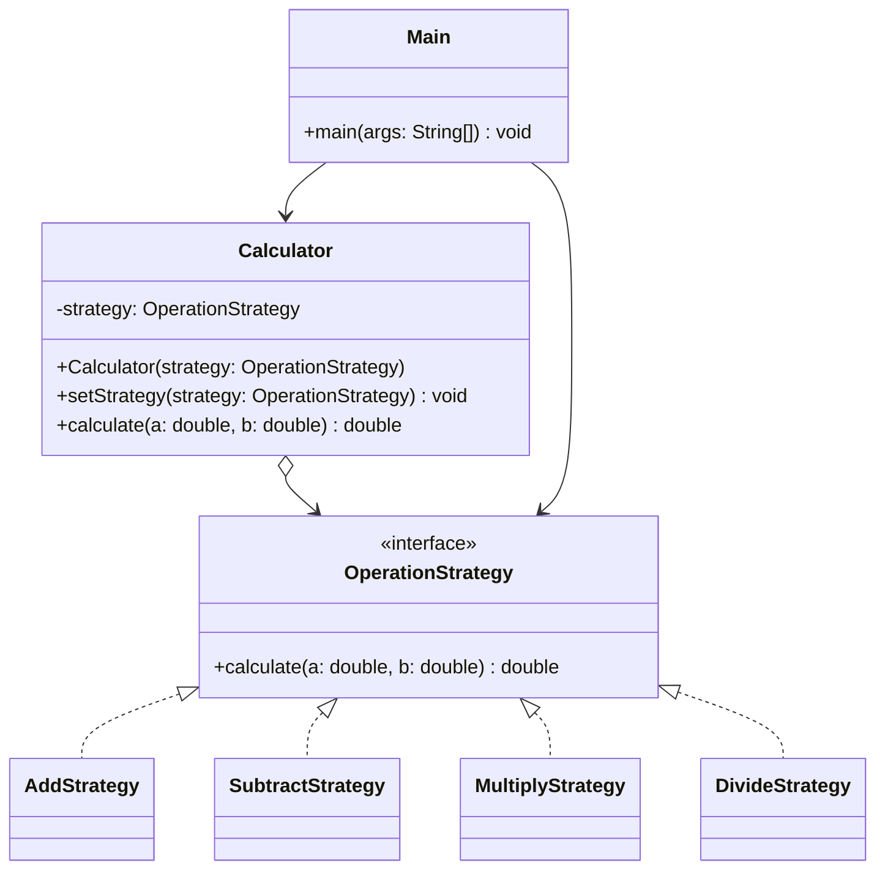

# Strategy Calculator UML

```mermaid
classDiagram
    class OperationStrategy {
        <<interface>>
        +calculate(a: double, b: double) double
    }

    class Calculator {
        -strategy: OperationStrategy
        +Calculator(strategy: OperationStrategy)
        +setStrategy(strategy: OperationStrategy) void
        +calculate(a: double, b: double) double
    }

    class AddStrategy
    class SubtractStrategy
    class MultiplyStrategy
    class DivideStrategy

    class Main {
        +main(args: String[]) void
    }

    OperationStrategy <|.. AddStrategy
    OperationStrategy <|.. SubtractStrategy
    OperationStrategy <|.. MultiplyStrategy
    OperationStrategy <|.. DivideStrategy

    Calculator o--> OperationStrategy
    Main --> Calculator
    Main --> OperationStrategy
```
